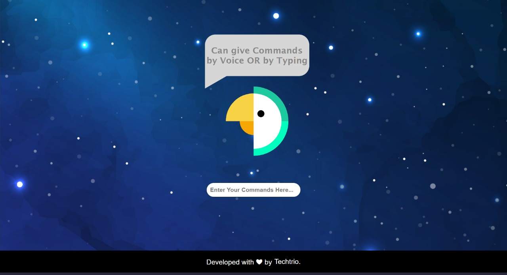

# Techtrio Virtual Assistant


Project made by Team "Techtrio".

## Table of Contents
- [Description](#description)
- [How to Use](#how-to-use)
- [Contact](#contact)
- [Contributing](#contributing)

---

## Description

This is virtual assistant project developed by the team Techtrio (Hackathon contest). This project is useful to do various  activities  by  using  users voice and as well as we can give command by texting also. It is made to  provide ease in peoples life. You can perform below mentioned features by giving command through voice or by texting in input box. <br>


#### Features

- Can give commands by both "Voice" & "Text"
- Login to any website
- Create shopping list
- Create events in google calender
- Give Alert Message
- Get updates of News
- Do search on Google
- Do search on Youtube
- Know the time
- Know about the weather
- Play some games
- Ask random queries
- Open many other Application
- Listen Jokes

#### Technologies
- Python
- Flask webframework
- Html
- CSS

---

## How to use

### Prerequisite
- Download Python

### Steps to be followed to use this Project
- Make a new folder
- Open cmd in that folder
- Install virtualenv by command : pip install virtualenv
- Now create a virtual environment named "assistant" by command :
 > virtualenv assistant
- Now activate environment by command :
 > .\assistant\Scripts\activate
- Now clone the github repository by command :
 > git clone https://github.com/dminiac/Virtual-assistant-using-Python.git

- Move inside project by command :
 > cd virtual-assistant
- Download PyAudio library whl according to your python version from https://pypi.org/project/PyAudio/#files and install it in the virtual by command :
 > pip install name_of_the_file.whl
- Before installing the libraries mentioned in requirements.txt use this command :
 > pip install Pillow , psycopg2
- Now install all other required libraries by command :
 > pip install -r requirements.txt
- If installation of any library fails then install it individually :
 > pip install <name of library>
- Now run the project by command :
 > python main.py
- Open the link :
 > 127.0.0.1:5000/  
 
 ### Instructions:
 [instructions](instructions.md)
    
---    

## Contact
- Ashish Choudhary - choudharyashish621@gmail.com  - https://www.linkedin.com/in/ashish-choudhary321/


---

## Contributing
1. Fork it
   ```https://github.com/dminiac/Virtual-assistant-using-Python.git```
2. Create your feature branch: 
   ```git checkout -b feature/foobar```
3. Commit your changes: 
   ```git commit -am 'Add some foobar'```
4. Push to the branch: 
   ```git push origin feature/foobar```
5. Create a new Pull Request

